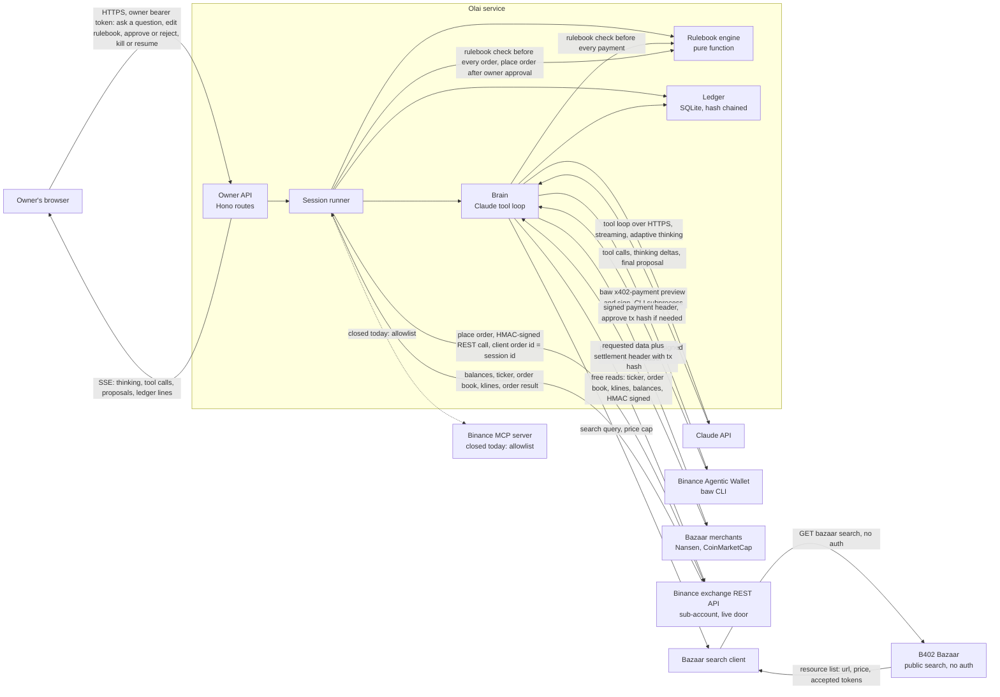
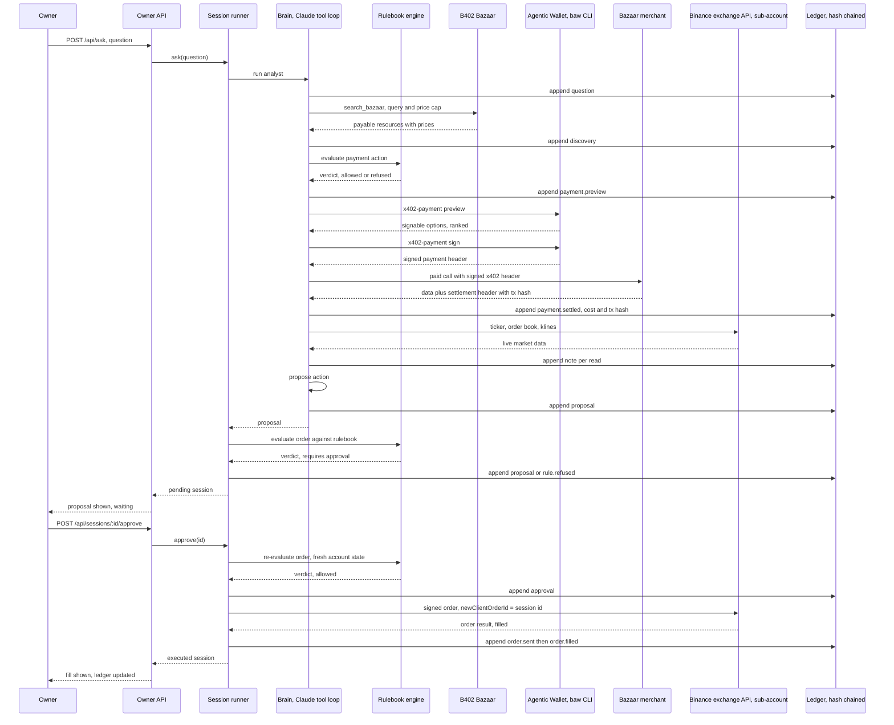
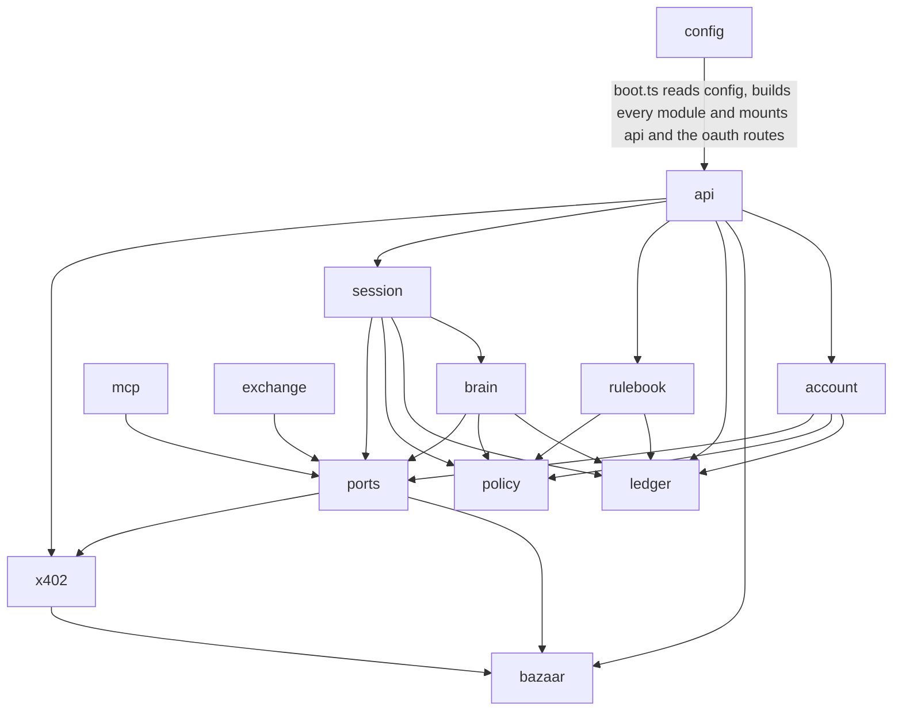

# Olai: architecture

## What Olai does

Olai is an analyst agent for a Binance sub-account. A trader hands it a funded
Agentic sub-account and a rulebook written in plain English: the biggest order
size, the most it can lose in a day, which markets it may trade, a daily budget
for buying data. When asked a question like "should I trim my BNB position",
Olai searches Binance's B402 Bazaar for paid market data (wallet flows, quotes),
pays for it a cent at a time from its Binance Agentic Wallet over x402, reads the
live order book through Binance's exchange REST API on the sub-account, and
proposes one action. The owner approves or rejects on the dashboard, and every
step, cost, and rulebook verdict lands in a hash-chained ledger nobody can
quietly edit.

Olai's exchange leg was meant to run through Binance's hosted MCP server, one
of the four Agent OS doors. Binance's authorization-server metadata advertises
clients that register themselves by a metadata document, and Olai's own OAuth
client reached the consent page by that published spec, but the page answered
"The AI Agent you are using is not currently supported. Please connect using a
supported Agent to continue. (3346001-e450fe8d)": Binance's allowlist admits
only its own agents (Claude Code, Codex, ChatGPT, VS Code, Grok) today. Binance's
own docs list the exchange REST and WebSocket APIs as one of the Agent OS tools
in their own right, so Olai trades through that door instead: a trade-only HMAC
key on an isolated sub-account, no withdrawal permission, proven first on the
spot testnet. The MCP client in `packages/agent/src/mcp` is complete and tested
and stays in the repo, held until Binance opens the allowlist to third-party
agents.

## System overview

## Main sequence

One question, end to end, on a live order.

## Module dependency graph

Arrows drawn from the real `import` lines in `packages/agent/src` (grep run
2026-09-06). Direction is "depends on".

Note on the boot edge: `src/index.ts` loads config and calls `buildService` in
`src/boot.ts`, which opens the ledger, picks the exchange (the REST API on an
isolated sub-account when `BINANCE_API_KEY` and `BINANCE_API_SECRET` are set,
the Binance MCP client when a stored token exists instead, otherwise the fake
exchange in dry run only), builds the session runner, and mounts both
`api/app.ts` and the OAuth routes on one Hono app. `policy` and `ledger` are
the two modules with no outgoing edges; they import nothing else in `src`.
`exchange` depends only on `ports` (for shared types) and is otherwise
self-contained across its own three files (`rest.ts`, `schemas.ts`, `sign.ts`);
it is the door actually open, because Binance's MCP consent screen refuses
Olai's own OAuth client today. `mcp` depends only on `ports` and is otherwise
self-contained across its own four files (`client.ts`, `exchange.ts`,
`oauth.ts`, `toolmap.ts`); it is coded and tested but held unused until Binance
admits third-party agents.

## What the frontend reads and writes

Every route lives in `packages/agent/src/api/app.ts`. Every `/api/*` route
needs `Authorization: Bearer <owner token>` (checked in `api/auth.ts`,
`ownerAuth`) and is rate limited to 60 requests a minute per address. `/health`
needs no token. Body limit on every route is 64 KB.

| Route | Method | Auth | Body | Response shape | Ledger kinds produced |
|---|---|---|---|---|---|
| `/health` | GET | none | none | `{ ok, dryRun, killed, version }` | none |
| `/api/rulebook` | GET | owner token | none | the stored `Rulebook`, or the starter default | none |
| `/api/rulebook` | PUT | owner token | a `Rulebook` object | the saved, validated `Rulebook` | `rulebook.set` |
| `/api/ask` | POST | owner token | `{ question: string, 1 to 2000 chars }` | a `SessionRecord`: id, question, status, proposal, verdict | `question`, `discovery`, `payment.preview`, `payment.settled`, `note`, `proposal`, `rule.refused` (path dependent) |
| `/api/sessions` | GET | owner token | none | array of `SessionRecord` | none |
| `/api/sessions/:id` | GET | owner token | none | one `SessionRecord`, 404 if unknown | none |
| `/api/sessions/:id/approve` | POST | owner token | none | updated `SessionRecord` | `approval`, `order.sent`, then `order.filled` or `order.failed`; or `rule.refused` if the re-check fails |
| `/api/sessions/:id/reject` | POST | owner token | `{ reason?: string, up to 500 chars }` | updated `SessionRecord` | `rejection` |
| `/api/kill` | POST | owner token | none | `{ killed: true }` | `kill` |
| `/api/resume` | POST | owner token | none | `{ killed: false }` | `resume` |
| `/api/ledger` | GET | owner token | query: `afterSeq`, `limit` (max 500), `kinds`, `sessionId` | `{ entries, nextAfterSeq }` | none, read only |
| `/api/ledger/verify` | GET | owner token | none | `{ ok: true, length }` or `{ ok: false, brokenAtSeq, reason }` | none |
| `/api/account` | GET | owner token | none | `AccountState`: equity, daily loss, data spend, open positions | `note` (only the first call of a new UTC day, records day-start equity) |
| `/api/wallet` | GET | owner token | none | `{ status, settings, balances }`, or `{ status: 'unavailable' }` if no wallet configured | none |
| `/api/bazaar/search` | GET | owner token | query: `query`, `maxUsdPrice` | `{ resources: BazaarResource[] }` | none |
| `/api/events` | GET, SSE | owner token | none | a stream of `{ event, data }`, a `ready` event first, then `heartbeat` comments every 15 seconds | none, this is the live commentary feed, not the durable record |

Separately, `mcp/oauth.ts` serves its own small route group
(`/oauth/client-metadata.json`, `/oauth/start`, `/oauth/callback`,
`/oauth/status`, `/oauth/disconnect`) for the Binance MCP consent flow. These
routes are not registered inside `createApp` in `api/app.ts`; as read, nothing
in `src` currently mounts them onto the same Hono app, so they are a separate
piece to wire in before the OAuth spike can run end to end through one server.

## Trust boundaries

- The model (Claude, inside `brain/analyst.ts`) can only call the tools it is
  handed: `search_bazaar`, `buy_data`, four free market reads, and `propose`.
  It never calls `placeOrder`. Only `session/session.ts` (`SessionRunner.approve`)
  calls `exchange.placeOrder`, and only after an explicit owner approval.
- The model never signs anything. Wallet signing (`Baw.x402Sign` in
  `x402/baw.ts`) is invoked from `brain/analyst.ts`'s `buy_data` tool, but the
  rulebook (`policy/engine.ts`, `evaluate`) is checked in code immediately
  before that call, and a refusal there stops the payment before the wallet is
  ever asked to sign.
- The rulebook engine (`policy/engine.ts`) is a pure function with no network
  or clock access. It runs in code before every payment (in `buy_data`) and
  before every order, twice: once when the proposal is first made
  (`SessionRunner.ask`) and again at approval time (`SessionRunner.approve`),
  against a fresh account snapshot, so a rulebook check made minutes earlier
  cannot authorize a trade against a state that has since changed.
- The ledger (`ledger/ledger.ts`) is append only: SQLite triggers
  (`ledger_no_update`, `ledger_no_delete`) block `UPDATE` and `DELETE` outright.
  Every line's hash covers its own contents and the previous line's hash
  (`ledger/hash.ts`), so editing any old line, even by going around the
  triggers, breaks every hash after it, and `verifyChain()` names the first
  broken line.
- The owner's approval is a real HTTP call, `POST /api/sessions/:id/approve`,
  gated by the owner bearer token (`api/auth.ts`) and rate limited per address.
  It is never inferred from the model's own text output.
