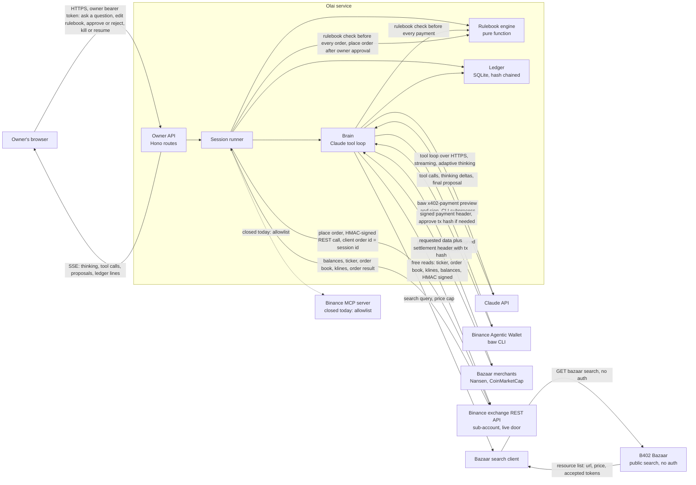
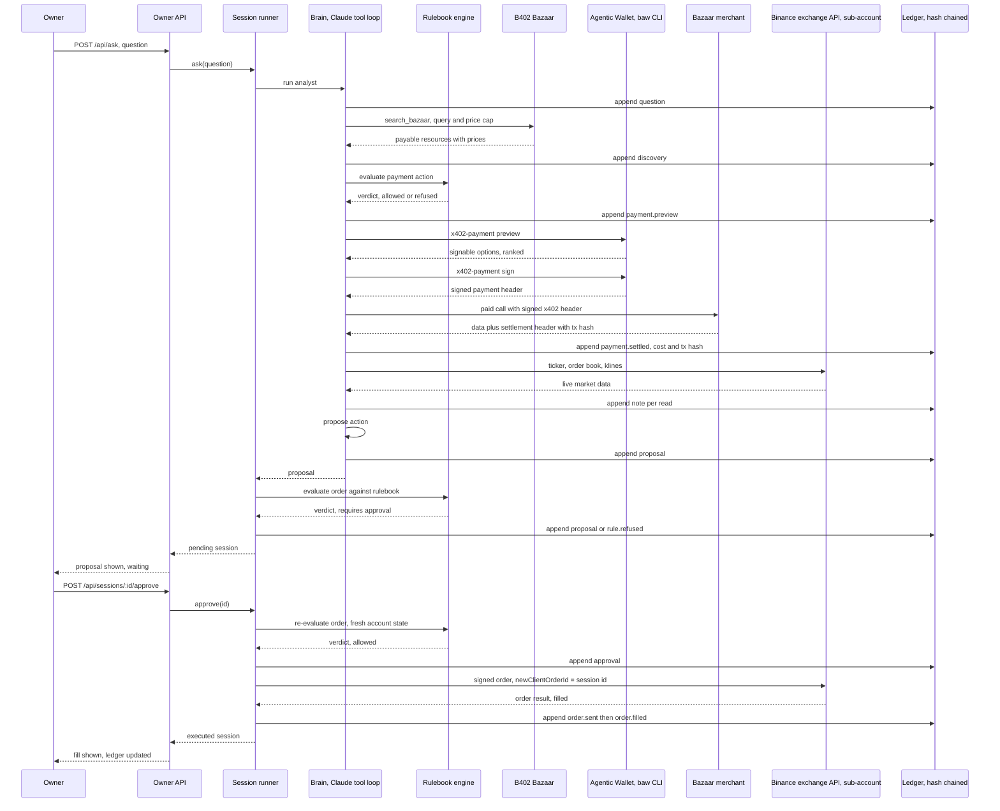
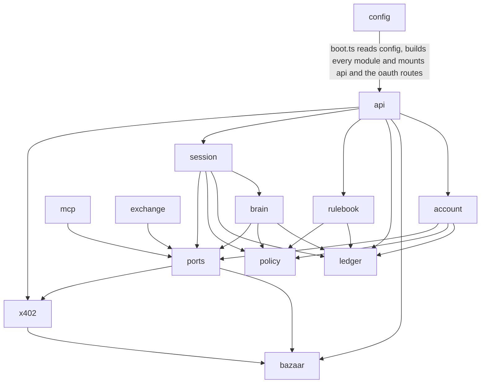

# Olai

An analyst agent that buys its own market intelligence a cent at a time from its Binance wallet, trades on the owner's Binance sub-account only inside a written rulebook, and can prove what every cent and every order was for.

[Live App](PENDING-LINK) · [Documentation](PENDING-LINK) · [Demo Video](PENDING-LINK)

## Live deployments

| Component | Where | Status |
|---|---|---|
| Olai service | Self-hosted, Node 22 | Coded and unit-tested; not yet deployed to a public host (`packages/agent`) |
| Binance exchange REST API | Binance-hosted, `https://testnet.binance.vision` by default, `https://api.binance.com` in prod | Live door: Olai trades through this API with a trade-only HMAC key on an isolated sub-account, no withdrawal permission, spot testnet first (`packages/agent/src/exchange/rest.ts`) |
| Binance MCP server | Binance-hosted, `https://agent.binance.com/mcp/agentic` | Held: Olai's own MCP client is coded and tested (`packages/agent/src/mcp`), but Binance's consent page answered "The AI Agent you are using is not currently supported. Please connect using a supported Agent to continue. (3346001-e450fe8d)" on 2026-09-06, because the allowlist admits only Binance's own agents; see `spikes/mcp-oauth/RESULT.md` and `STATE.md` |
| Binance Agentic Wallet | Binance-hosted, MPC wallet, driven through the `baw` CLI | Signed in and connected; the wallet needs a small BSC funding transfer before it can sign a live payment |
| B402 Bazaar | Binance-hosted, public catalogue at `https://www.binance.com/bapi/ramp/v1/public/ramp/b402/bazaar/resources` | Live, no auth required. A keyword search against it returned real listings on 2026-09-06 (see `reference/bazaar-catalog-summary.txt`) |
| Merchants used: Nansen, CoinMarketCap | Third parties, paid over x402 through the Bazaar | Both probed live and answered HTTP 402 on 2026-09-06 (`packages/agent/test/x402/merchants.test.ts`); not yet paid on a live run |

## Overview

A trader who wants an edge today either pays for a data subscription whether or not they use it that day, or hands an API key to a script and hopes it behaves. Neither one answers the question a desk actually has: what did this specific decision cost, and what stopped the agent from doing something worse than the trader would have allowed.

Olai is an analyst agent for one Binance sub-account. The owner writes a plain-English rulebook once: the biggest order, the most it may lose in a day, which markets it may touch, how much it may spend on data. When asked a question, Olai searches Binance's B402 Bazaar for the paid data that answers it, pays a merchant a cent or two straight from its Binance Agentic Wallet over x402, reads the live market through Binance's exchange REST API on the sub-account, and proposes one action. The owner approves or rejects it. Every step, every cost and every verdict lands in a hash-chained ledger that nobody, including Olai, can quietly edit afterward.

The product is not the trading idea. It is the control system around it: a rulebook enforced in code before the model's output ever reaches an order or a payment, and a ledger that turns "trust the agent" into "read the ledger."

### Today versus Olai

| | Today | Olai |
|---|---|---|
| How a trader pays for data | A monthly subscription and an API key, used or not | About one cent per call over x402, paid directly from a Binance wallet |
| Who decides what the agent may do | The model, in the moment | A written rulebook, checked in code before every payment and every order |
| What record exists afterward | Chat logs | A hash-chained ledger, with a settlement transaction hash on every payment |
| What stops a runaway agent | Nothing built for the purpose | The rulebook, a kill switch, and Binance's own sub-account isolation with no withdrawal scope |

## Features

**Ask and get a proposal.** One question in, one proposal out: hold, or a specific BUY or SELL sized in dollars, with a confidence, the risks, and every paid resource used to answer it. The model never places an order itself.
`packages/agent/src/brain/analyst.ts`

**Pay for data by the call.** Olai searches the B402 Bazaar, previews the price with the Binance Agentic Wallet, and pays a merchant over x402, usually about one cent. A payment id can only ever be signed once, even across a restart.
`packages/agent/src/bazaar/client.ts`, `packages/agent/src/x402/buyer.ts`, `packages/agent/src/ports/data.ts`

**Rulebook.** Max order size, max daily loss, allowed markets, a data budget per day and per call, trading hours, a cooldown between orders, drawdown tiers that halve or halt trading. Checked in code before anything moves, never decided by the model.
`packages/agent/src/policy/engine.ts`, `packages/agent/src/policy/rulebook.ts`

**Approve or reject.** The owner's yes or no is a real HTTP call gated by their own bearer token, never inferred from the model's text. Approving the same session twice still sends exactly one order.
`packages/agent/src/session/session.ts`

**Ledger and proof.** Every decision, payment and order is one hash-chained SQLite line. Editing an old line, even by hand-editing the file, breaks every hash after it, and one route names the first broken line.
`packages/agent/src/ledger/ledger.ts`, `packages/agent/src/ledger/hash.ts`

**Kill switch.** One call stops every future rulebook check from passing, trading and paying alike, and a stale account read can never undo it.
`packages/agent/src/session/session.ts`

**Dry run.** Prices a data call with the wallet without signing it, and logs an order without sending it to Binance. The same code path runs in the demo as in a live account.
`packages/agent/src/config.ts` (`OLAI_DRY_RUN`), threaded through `packages/agent/src/x402/buyer.ts` and `packages/agent/src/session/session.ts`

## What runs on Binance

| Agent OS piece | How Olai uses it |
|---|---|
| Exchange REST API | Reads the ticker, order book, klines, balances and positions, and sends spot orders, all through signed HTTP calls to the Spot REST API (`https://testnet.binance.vision` by default, `https://api.binance.com` when `BINANCE_API_ENV=prod`) with a trade-only HMAC key on an isolated sub-account, no withdrawal permission. Binance's own docs list this REST and WebSocket surface as one of the Agent OS tools in its own right. `packages/agent/src/exchange/rest.ts` |
| MCP server (held) | The other door to the same reads and orders. Olai's MCP client is coded and tested, selected by `OLAI_EXCHANGE=mcp` or by `auto` once a token exists, but Binance's consent screen refuses any agent outside its own allowlist, so this door stays closed until Binance admits third-party agents. `packages/agent/src/mcp/` |
| Agentic Wallet | Drives the `baw` CLI directly: `wallet status`, `wallet settings`, `wallet balance`, `x402-payment preview`, `x402-payment sign`, `wallet tx-history`. `packages/agent/src/x402/baw.ts` |
| x402 | Buyer side only. Signable on BSC (`eip155:56`), Base (`eip155:8453`) and Solana; BSC is tried first because that is where most Bazaar merchants settle and the wallet signs its stablecoins without a Permit2 approval. `packages/agent/src/bazaar/tokens.ts`, `packages/agent/src/x402/buyer.ts` |
| B402 Bazaar | Keyword search over `GET /bazaar/search` on the public catalogue, no key and no account needed. `packages/agent/src/bazaar/client.ts` |
| Skills Hub | Not called at runtime. The `binance-agentic-wallet` skill's docs (`reference/skills-hub-repo/skills/binance-web3/binance-agentic-wallet`) were read during R&D to build the wallet wrapper above. Nothing in the running service queries the Skills Hub API. |

## Architecture

### System overview



### Main sequence

One question, end to end, on a live order.



### Module dependency graph

Arrows drawn from the real `import` lines in `packages/agent/src`. Direction is "depends on".



`policy` and `ledger` are the two modules with no outgoing edges; they import nothing else in `src`. `exchange` depends only on `ports` (for shared types) and is otherwise self-contained across its own three files (`rest.ts`, `schemas.ts`, `sign.ts`); it is the door actually open, because Binance's MCP consent screen refuses Olai's own OAuth client today. `mcp` depends only on `ports` and is otherwise self-contained across its own four files (`client.ts`, `exchange.ts`, `oauth.ts`, `toolmap.ts`); it is coded and tested but held unused until Binance admits third-party agents.

## The two-minute judge path

1. Clone the repo and `cd` into it.
2. `npm install`. Needs Node 22 or newer (see `.nvmrc`).
3. Copy `.env.example` to `.env` and fill in the keys, explained below. At minimum you need `ANTHROPIC_API_KEY` and a `OLAI_OWNER_TOKEN` you invent yourself.
4. `npm run dry-run -w @olai/agent -- "Should I trim my BNB position before the weekend?"`

   This boots the whole service in dry-run mode and asks Olai that one question. It prints, in order: what it booted with (which exchange, the ledger path, the public address), the question, every tool call the agent makes and its result as it thinks, the final proposal with its confidence and risks, the rulebook's verdict, the approval and the resulting session status, every ledger line the session wrote, and whether the ledger's hash chain still holds across all of them.

5. `npm run prove -w @olai/agent`

   This is the prove-it command. It runs seven steps against the real Binance Agentic Wallet and the real B402 Bazaar, no MCP connection required, and prints one `PASS`, `FAIL` or `SKIP` line per step. Only step 4 can spend real money, and only when `.env` sets `OLAI_DRY_RUN=false` and `OLAI_PROVE_SPEND=yes`; every other step is read only.

   Expected shape of the output:

   ```
   PASS 1. wallet CONNECTED, x402 daily limit $..., quota left $...
   PASS 2. Bazaar has N wallet payable listings for "wallet balance" under $0.05, cheapest $... at ...
   PASS 3. a real 402 previewed to payment ... with N options, top option is READY_TO_SIGN for $... in ... on chain ...
   SKIP 4. OLAI_DRY_RUN is true, so Olai will not sign anything
   PASS 5. ... priced BNBUSDT at ...
   PASS 6. the ledger hash chain holds across all N lines
   PASS 7. this run spent $0.0000 across 0 settled payments (0 signatures claimed)
   Every step that ran, passed.
   ```

   Actual output from a live run:

   ```
   ```text
Olai: LIVE, exchange binance-spot-testnet, cap $0.0500 a call, $1.0000 a day

PASS 1. wallet CONNECTED, x402 daily limit $20, quota left $20
PASS 2. Bazaar has 3 wallet payable listings for "wallet balance" under $0.05, cheapest $0.0100 at https://api.nansen.ai/api/v1/profiler/address/current-balance
PASS 3. a real 402 previewed to payment 5755ab1a-1ba6-440f-83a9-202d32d6d9d9 with 8 options, top option is READY_TO_SIGN for $0.0100 in USDT on chain 56
PASS 4. paid $0.0100, settlement 0xd31a8a75f6df501e1aba6166b248a2a8a1e928a52c401fae9465181082ad9a43, data starts: {"pagination":{"page":1,"per_page":10,"is_last_page":false},"data":[{"chain":"ethereum","address":"0x28c6c06298d514db089934071355e5743bf21d60","token_address":"0xdac17f958d2ee523a2206206994597c13d831e
PASS 5. binance-spot-testnet priced BNBUSDT at 757.01
PASS 6. the ledger hash chain holds across all 16 lines
PASS 7. this run spent $0.0000 across 0 settled payments (1 signatures claimed)

Every step that ran, passed.
```

Run on 2026-09-06 with `OLAI_DRY_RUN=false OLAI_PROVE_SPEND=yes`. The receipt for that settlement, read from a BNB Smart Chain node: status success, block 120274603, 0.0100 USDT from the Agentic Wallet `0xC75126992E4744a75665405e9b427710C0d23052` to Nansen at `0x93053f1e7A5eFEDa532Fe69CbbE43cBEc3A0F13f` through Binance's Permit2 spender, gas paid by Binance's signer. Step 7 in that run counted settled lines only; since the code review the daily spend counts at signature time, so the same run today reports $0.0100 spent. A second run through the corrected path paid another cent, settlement `0x6962ad36ff991759c5801254aefaba68f8041a401f5a57b022a66976750f4335` (block 120285949, verified from a BNB Smart Chain node), and that run's step 7 reads `PASS 7. this run spent $0.0100 across 1 settled payments (1 signatures claimed)`.

The full loop has also run live against the Binance spot testnet: a question through the owner API, a one-cent Nansen purchase inside the session (settlement `0xb495d3c91ebff850ce01e19dc8826e8adf433028b3516f48a8ad04b1522ce9bb`), a proposal to buy $15.00 of ETH with a limit at 2502.40, the rulebook's verdict (allowed, approval required), the owner's approval from the desk, and testnet order `9117738` filled for 0.0059 ETH at 2500.01. Those lines are the captured ledger sequence the landing page plays back, exported from the real ledger into `packages/web/public/ledger-sample.json`.
   ```

## Quick start

Every setting Olai reads, from `.env.example`:

| Key | What it controls |
|---|---|
| `ANTHROPIC_API_KEY` | Olai's brain. A key from console.anthropic.com. |
| `OLAI_OWNER_TOKEN` | The password to Olai's own API. Must start with `ol.` and be at least 24 characters. Anyone holding it can approve trades. |
| `OLAI_PORT` | Port the local Olai service listens on. Defaults to 4000. |
| `OLAI_DB_PATH` | Where the SQLite audit ledger file is written, relative to `packages/agent`. |
| `OLAI_RULEBOOK_PATH` | Where the owner's rulebook is stored. Edit it through the API, not by hand, so the ledger records every version. |
| `OLAI_WEB_ORIGIN` | The one browser origin allowed to call Olai's API. |
| `OLAI_TRUST_PROXY` | Only `true` when a proxy in front of Olai rewrites `X-Forwarded-For` itself. Leave `false` locally. |
| `OLAI_EXCHANGE` | Which door to Binance: `auto` picks the REST API when a key is set, else the MCP session when a token exists, else the stand-in (dry run only); `rest`, `mcp` and `fake` force one door. `mcp` is coded but unusable today, see Security. |
| `BINANCE_API_KEY` / `BINANCE_API_SECRET` | The trade-only HMAC key on an isolated sub-account that Olai actually trades with. Generate a free key at `https://testnet.binance.vision` to start; for live money, a sub-account key with Enable Spot Trading only, no withdrawals, IP-restricted. |
| `BINANCE_API_ENV` | `testnet` or `prod`. Defaults to `testnet` so a pasted key cannot spend real money before a dry run has been read line by line. |
| `OLAI_DRY_RUN` | `true` means Olai plans trades and payments but never sends them. Set to `false` only for a live run. |
| `BINANCE_MCP_URL` | Binance's hosted MCP server address, used only when `OLAI_EXCHANGE=mcp`. |
| `OLAI_PUBLIC_BASE_URL` | The public HTTPS address Binance can reach Olai on during OAuth sign-in. Needs a tunnel in development. |
| `OLAI_TOKEN_PATH` | Where the Binance sign-in token is stored, owner-only permissions. |
| `OLAI_CLIENT_NAME` | The name shown on the Binance consent screen. |
| `BAZAAR_BASE_URL` | Base address of the B402 Bazaar. |
| `OLAI_PROVE_SPEND` | Only `yes` lets `npm run prove` spend real money on one paid data call, and only when `OLAI_DRY_RUN` is also `false`. |

## Owner API

Every route lives in `packages/agent/src/api/app.ts`. Every route under `/api/*` needs `Authorization: Bearer <owner token>` and is rate limited to 60 requests a minute per address; the body limit on every route is 64 KB. `/health` needs no token.

| Route | Method | Auth | Body | Response |
|---|---|---|---|---|
| `/health` | GET | none | none | `{ ok, dryRun, killed, version }` |
| `/api/rulebook` | GET | owner token | none | the stored rulebook, or the starter default |
| `/api/rulebook` | PUT | owner token | a rulebook object | the saved, validated rulebook |
| `/api/ask` | POST | owner token | `{ question }`, 1 to 2000 characters | a session record: id, question, status, proposal, verdict |
| `/api/sessions` | GET | owner token | none | array of session records |
| `/api/sessions/:id` | GET | owner token | none | one session record, 404 if unknown |
| `/api/sessions/:id/approve` | POST | owner token | none | the updated session record |
| `/api/sessions/:id/reject` | POST | owner token | `{ reason? }`, up to 500 characters | the updated session record |
| `/api/kill` | POST | owner token | none | `{ killed: true }` |
| `/api/resume` | POST | owner token | none | `{ killed: false }` |
| `/api/ledger` | GET | owner token | query: `afterSeq`, `limit` (max 500), `kinds`, `sessionId` | `{ entries, nextAfterSeq }` |
| `/api/ledger/verify` | GET | owner token | none | `{ ok: true, length }` or `{ ok: false, brokenAtSeq, reason }` |
| `/api/account` | GET | owner token | none | equity, daily loss, data spend, open positions |
| `/api/wallet` | GET | owner token | none | `{ status, settings, balances }`, or `{ status: 'unavailable' }` |
| `/api/bazaar/search` | GET | owner token | query: `query`, `maxUsdPrice` | `{ resources }` |
| `/api/events` | GET, SSE | owner token | none | a stream of `{ event, data }`, a `ready` event first, heartbeat every 15 seconds |

The five OAuth routes that get a human through the Binance consent screen (`/oauth/client-metadata.json`, `/oauth/start`, `/oauth/callback`, `/oauth/status`, `/oauth/disconnect`) live in `packages/agent/src/mcp/oauth.ts` as a separate router, not in this table.

## Tests

Test output from a full run:

```
```text
Test Files  26 passed (26)
Tests  203 passed | 1 skipped (204)
```

Run on 2026-09-06 after the code review fixes. The one skipped test loads the live MCP tool list when `reference/mcp-tools.json` exists, and that file cannot exist until Binance admits third-party agents.
```

What each test folder under `packages/agent/test` covers:

- `account/` reads exchange balances and the ledger into the numbers the rulebook checks: today's loss, positions, the data budget spent so far.
- `api/` covers the owner API's routes, the bearer-token auth, the rate limiter, and the server-sent event stream.
- `bazaar/` parses real recorded Bazaar search and resource responses, including the client-side `maxUsdPrice` filter.
- `boot/` wires the whole service together against a fake exchange, a fake wallet and a scripted Claude client, and proves a bad config refuses to boot.
- `brain/` runs the analyst's tool loop, `search_bazaar`, `buy_data`, the free read tools and `propose`, against a scripted Anthropic client.
- `config.test.ts` (no subfolder) checks that every setting gets a sane default and that a bad or missing one fails loudly at boot.
- `ledger/` covers the hash chain and its append-only triggers with a worked example, plus a property-based run proving any legal sequence of writes still verifies and adds up to the cent.
- `mcp/` covers the MCP client over an in-memory transport, the OAuth PKCE and state-check flow against a fake authorization server, the tool-name resolver, and turning a venue's answer into an exact port type or a loud refusal.
- `policy/` covers the rulebook engine rule by rule with worked examples and property-based invariants, plus the rulebook's own input schema.
- `ports/` pins the behaviour of the deterministic fake exchange and fake data port that the rest of the suite relies on.
- `rulebook/` covers saving and loading the rulebook file, the atomic rename on write, and the ledger line every save produces.
- `session/` covers asking, approving, rejecting, killing and resuming a session, including the double-approval and double-order guards.
- `x402/` covers the `baw` CLI wrapper's parsing, a real recorded Nansen 402 paid through a scripted wallet, and the two merchant request builders.

## What things cost, in plain English

A data call is about one cent, paid in a BSC stablecoin, with gas sponsored so the cent is the whole cost. A dry run costs nothing except the Claude API tokens spent thinking, since the model still runs even though nothing is signed or sent. An approved live order costs whatever Binance's own spot trading fees are; Olai does not add anything on top.

The rulebook Olai starts with (`packages/agent/src/rulebook/store.ts`, `defaultRulebook`) caps all of this by default: the biggest single order is $20, trading stops for the day at a $10 loss (halving the order size at $5, halting at $10), the biggest position in one market is $50, data spending is capped at $1 a day and $0.05 a call, there is a 60 second cooldown between orders, and every order needs the owner's approval regardless of size. The owner edits every one of these through `PUT /api/rulebook`.

## Project structure

```
packages/agent/src/
  account/     turns exchange balances and the ledger into the numbers the rulebook checks
  api/         the owner's HTTP API: routes, auth, rate limiting, errors, the event stream
  bazaar/      the B402 Bazaar search client and its token-to-dollar pricing table
  brain/       the Claude tool loop that reads markets, buys data and proposes one action
  exchange/    the Binance exchange REST API client: HMAC signing, schemas, the live trading door
  ledger/      the hash-chained SQLite audit ledger
  mcp/         the Binance MCP client, OAuth flow, tool-name resolver, and exchange adapter (coded, held unused)
  policy/      the rulebook engine and the rulebook's own schema
  ports/       the exchange and data door interfaces, plus deterministic fakes for tests
  rulebook/    where the owner's rulebook is stored on disk and versioned in the ledger
  session/     the session runner: ask, approve, reject, kill, resume
  x402/        the wallet CLI wrapper, the buyer that pays a merchant over x402, and merchant request builders
  boot.ts      wires every piece together into one running service
  config.ts    reads and validates every environment setting once, at boot
  index.ts     starts the HTTP server and shuts it down cleanly
```

## Tech stack

| Library | Version | Used for |
|---|---|---|
| Node.js | 22 or newer | runtime, `engines.node` in both `package.json` files |
| @anthropic-ai/sdk | 0.124.0 | the Claude tool loop in `brain/analyst.ts` |
| @modelcontextprotocol/sdk | 1.30.0 | the Binance MCP client and OAuth flow |
| hono | 4.13.7 | the owner API's HTTP router |
| @hono/node-server | 2.1.1 | runs the Hono app under Node |
| better-sqlite3 | 13.0.3 | the hash-chained ledger |
| execa | 10.0.1 | runs the `baw` CLI as a subprocess, no shell |
| zod | 4.5.4 | validates every boundary: config, API bodies, Bazaar and MCP and wallet responses |
| pino | 10.3.1 | structured logging |
| typescript | 7.0.2 | the whole codebase |
| vitest | 5.0.0 | unit and property tests |
| fast-check | 4.9.0 | the property-based (fuzz) tests |
| tsx | 4.23.13 | runs TypeScript directly for `dev`, `dry-run` and `prove` |

npm workspaces (root `package.json`) manage the one package, `@olai/agent`, under `packages/*`.

## Security

The full threat model, the list of attackers, every entry point mapped to code, and the controls that answer each one live in `docs/security/threat-model.md`. It also lists, in its own words, the weaknesses that were not fixed: unrealized price moves count toward the daily loss limit the same as a realized loss, in-memory guards against a double order or a double signature do not survive a process restart, a compromised Binance API key could trade on the sub-account up to its balance though it could never withdraw, and a few operational steps (a public HTTPS tunnel for OAuth, the wallet's own session expiry) sit outside what code can control.

This is self-audited. Nobody outside this project has reviewed the code, and no automated static-analysis tool has run against it yet. `docs/security/threat-model.md` section 7 says plainly what a third-party audit would still need to check.

## Licence

MIT.

## Acknowledgements

Built on Binance's Agent OS: the Binance exchange REST API, the Binance Agentic Wallet, B402 and the B402 Bazaar, and the Skills Hub. The Binance MCP server is also part of Agent OS and Olai's client for it is coded and tested, held until Binance's consent screen admits third-party agents.
