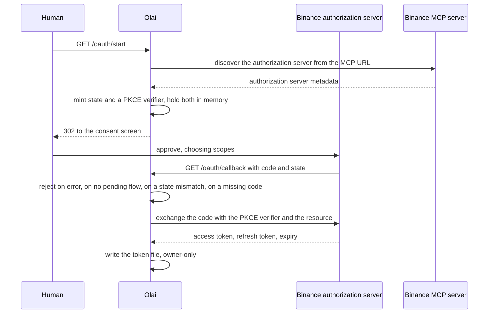

# The MCP client

This door is closed today. Binance's authorization-server metadata advertises
client-id-metadata-document clients, and Olai's own OAuth client reached the consent page by
that published spec, but the page answered "The AI Agent you are using is not currently
supported. Please connect using a supported Agent to continue. (3346001-e450fe8d)": the allowlist
admits only Binance's own agents (Claude Code, Codex, ChatGPT, VS Code, Grok) today. Everything
below is complete and tested, and it is what Olai will use the moment Binance opens the door,
selectable now with `OLAI_EXCHANGE=mcp`. Until then, Olai trades through
[the exchange REST API](../concepts/why-binance-agent-os.md) instead.

Four files, in `packages/agent/src/mcp/`: `oauth.ts` for the sign-in, `client.ts` for the
session, `toolmap.ts` for working out which tool is which, and `exchange.ts` for turning a tool's
answer into an exact type.

## The sign-in

Binance publishes no client registration endpoint, so there is nothing to sign up for. Their
authorization server accepts a URL as the client id and fetches the client's own description from
it: `client_id_metadata_document_supported` is true in their metadata. That is why Olai serves
its description at `${OLAI_PUBLIC_BASE_URL}/oauth/client-metadata.json` and hands Binance that
same URL as its client id. Olai is its own registered client and never borrows another vendor's.

The document Olai serves:

```json
{
  "client_id": "https://<your public base url>/oauth/client-metadata.json",
  "client_name": "Olai",
  "redirect_uris": ["https://<your public base url>/oauth/callback"],
  "token_endpoint_auth_method": "none",
  "grant_types": ["authorization_code", "refresh_token"],
  "response_types": ["code"]
}
```

The `client_id` inside the document has to equal the URL the document is served from, otherwise
the authorization server rejects the client.



Four details in `BinanceOAuth`:

- **PKCE with S256 and a random `state`**, both minted by the MCP SDK's own functions so the
  request shapes stay correct as the specification moves. The verifier is held in memory only: a
  restart between the two steps means starting again, which is safer than writing a live code
  verifier to disk.
- **The state check is what stops a stranger feeding Olai their own authorization code.** A
  mismatch throws `state_mismatch` and abandons the flow.
- **The RFC 8707 `resource` parameter pins the token to `BINANCE_MCP_URL`** specifically, so the
  token is not usable against some other server.
- **The token file is written with owner-only permissions** (`0600`) and re-chmodded after every
  write, because the mode option on the write itself is only honoured when the file is created.
  On Windows that chmod is a no-op, and the code says so plainly rather than pretending
  otherwise.

Refresh happens on read: `currentToken()` refreshes when the access token is within a minute of
expiry and a refresh token exists. If the refresh itself fails it returns the old token rather
than throwing, so the caller sees the real 401 from Binance instead of a refresh error hiding it.

The same class exposes an `authProvider()` for the SDK's HTTP transport, so connecting through
the transport and connecting through the routes share one token file and one session.

## The session

`BinanceMcp` in `client.ts` owns the connection. It opens the SDK's streamable HTTP transport
with the OAuth adapter attached, which attaches the bearer token and retries once after a 401.
The class adds two things on top: one place that owns the connection lifetime, and a call result
flattened into plain data, so the rest of the agent never handles MCP content blocks. Structured
content is preferred; a single text block that parses as JSON comes back parsed; anything else
comes back whole.

Connecting before consent has been given throws with code `consent_required`, because that is a
human step and the message says so.

## The tool map

Binance publishes no tool list. The names are only visible after connecting. So
`packages/agent/src/mcp/toolmap.ts` is deliberately the only place in Olai that decides a tool
name: it reads `tools/list` at runtime and matches names by keyword.

Seven slots:

| Slot | What it must do | Required |
|---|---|---|
| `ticker` | last price and the 24 hour move | yes |
| `orderBook` | top of the book | yes |
| `klines` | candles | yes |
| `balances` | sub-account balances | yes |
| `positions` | open positions | no, a spot-only server has none and that is not a failure |
| `placeOrder` | send an order | yes |
| `orderStatus` | read one order back | yes |

How the matching works, and why it is careful:

- **Names are split into words first.** An underscore counts as a word character in a regular
  expression, so `\bprice\b` never matches `get_price`. Turning `get_price` and `getPrice` into
  "get price" lets every pattern use plain word boundaries.
- **Narrow slots resolve first**, and a tool claimed by one slot is out of the running for every
  later slot, so a generic word like "order" cannot be eaten by the wrong one.
- **Deny lists guard the dangerous slot.** Anything that reads, lists, cancels, replaces or
  amends is barred from `placeOrder`, so the slot that actually spends money can only ever be
  filled by a tool that sends an order.
- **Descriptions are a tie-breaker only**, never the main evidence.
- **Overrides win, but the named tool has to exist.** Passing an override for a tool the server
  does not offer is an error at connect time, not a failed trade later.

An unfilled required slot throws `ToolMapError`, which names every missing slot and lists every
tool the server offers, so the fix is one glance away.

This mapping is unverified against the live server. It is the honest gap in this part of the
system: a mismatch surfaces as a `ToolMapError` at connect time or an `ExchangeShapeError` on a
bad response shape, not as a silently wrong trade, but nobody has yet published the real names
for us to check against.

## Reading a tool's answer

`exchange.ts` turns a port call into a tool call and the answer into the exact port type. It
trusts no shape:

- A `{ code, message, data }` wrapper is stripped, but only when every other key is wrapper
  furniture, so a real payload that happens to carry a `data` field is left alone.
- Every field is read through a list of plausible names, then piped into a strict schema.
- Numbers arrive as numbers or as strings and both are accepted, but anything that is not finite
  fails.
- Timestamps arrive as milliseconds, seconds or an ISO string. Anything below the 1973 cutoff has
  to be seconds.
- A field that is missing or unreadable throws `ExchangeShapeError` naming the tool and the
  detail, rather than handing the trading brain a NaN price.
