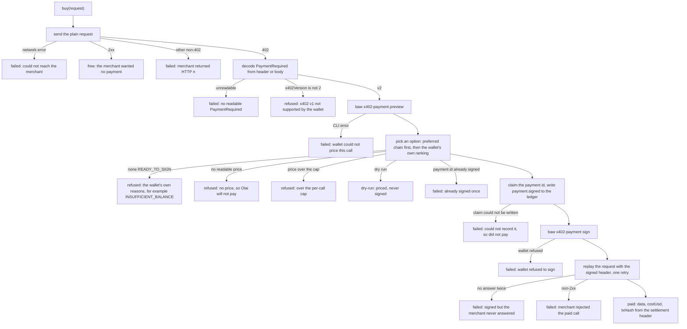

# The x402 buyer

Two files do the buying: `packages/agent/src/bazaar/client.ts` finds things to buy, and
`packages/agent/src/x402/buyer.ts` buys one of them.

## Finding something to buy

The B402 Bazaar is Binance's public index of paid endpoints. It needs no key and no account.
`BazaarClient` is the only place in Olai that talks to it, against two paths under
`BAZAAR_BASE_URL`:

| Method | Path | What it does |
|---|---|---|
| `search({ query, maxUsdPrice, network, limit })` | `/bazaar/search` | Keyword search. Always asks for the endpoint's maximum page of 20, then trims. |
| `list({ limit, offset })` | `/bazaar/resources` | A paginated walk of the whole catalogue, newest first. |

Every response goes through a `{ code, message, data }` envelope check first: anything but code
`000000` throws a `BazaarError` carrying the Bazaar's own code and message. Network failures and
non-200 responses throw the same error type with `NETWORK` or `HTTP_<status>`.

Two decisions in that file are worth knowing about.

**The price filter runs on our side.** The Bazaar has its own `maxUsdPrice` parameter, and on
2026-09-06 it returned an empty list for every value tried, including values far above the most
expensive listing. Relying on it would make Olai believe there is nothing it can afford, so the
filter is applied locally after parsing.

**A resource Olai cannot price is dropped.** A merchant writes its price in base units of a
token, so `10000000000000000` means one cent of an 18-decimal BSC stablecoin. Turning that into
dollars needs the token's decimals, and Olai never guesses: `packages/agent/src/bazaar/tokens.ts`
holds the tokens seen carrying a price in the live catalogue and in real 402 responses, and an
unknown token gives a null price, which the filter treats as "do not buy". The conversion is done
in BigInt, because one cent of an 18-decimal token is past the range where a double counts whole
numbers exactly.

Each resource comes back with `walletPayable`, which is true only when the listing is x402
version 2 and offers at least one option the Binance wallet can sign: BNB Smart Chain
(`eip155:56`), Base (`eip155:8453`) or Solana, with a scheme in `exact`, `eip3009`,
`permit2-exact`, `permit2` or `spl-transfer`. Ethereum, Arbitrum and Polygon appear in listings
and the wallet refuses them, so those listings are not payable for Olai.

## Buying it

`buy(req, opts)` in `packages/agent/src/x402/buyer.ts` is one paid HTTP call, start to finish.
Every exit is a named outcome rather than an exception, because "we did not pay, and here is why"
is a normal answer for an agent that spends money.

### The six outcomes

| Status | Meaning |
|---|---|
| `free` | The endpoint answered without asking for payment. |
| `dry-run` | Priced with the wallet, stopped before the signature. Carries the real cost and the chosen option. |
| `refused` | Olai decided not to pay. Carries the reason and, where it could be read, the cost. |
| `paid` | Data, cost, settlement transaction hash, payment id, the option used, and the raw settlement. |
| `failed` | Something broke. Carries the reason and, once one exists, the payment id. |

### The rules inside it

**One signature per payment id.** A signature from the wallet is single use and spends real
money. The id is claimed before the signing call, not after, so a signature that throws still
counts as used. Two guards run: an in-memory set, which does not survive a restart, and
`ledgerSignatureGuard` in `packages/agent/src/ports/data.ts`, which asks the ledger whether a
`payment.signed` line already exists for that id and writes one before the wallet is asked. A
claim that cannot be written stops the payment: money Olai cannot account for is money Olai
will not spend.

**BNB Smart Chain first.** The preferred chain list defaults to `['56']`. It is where nearly
every Bazaar merchant settles, its stablecoins are the ones the Binance wallet signs without a
Permit2 approval, and its fees are the cheapest of the three supported chains. Within a chain,
the wallet's own ranking wins, and it already puts the cheapest, approval-free options first.

**The cap is an argument, not a setting.** `maxUsdPerCall` is passed on every call, worked out
from the rulebook at the moment of spending, so a rulebook edit takes effect on the very next
call.

**One retry on the replay, no more.** A signature is valid until `signatureExpiresAt` and can be
used once, so hammering a merchant risks burning it against a broken connection.

**A Permit2 approval is logged as a warning.** When the wallet dispatches an approval alongside
the signature, the merchant may reject the replay until that approval confirms. Funding the
wallet with USD1 or U on BSC avoids the step.

### What a settlement gives you

The merchant's answer carries a settlement header. `decodeSettlement` and `txHashFromSettlement`
in `packages/agent/src/x402/paymentRequired.ts` pull the on-chain transaction hash out of it.
That hash is what makes the ledger's claim checkable: `payment.settled` carries the cost in cents
and the hash, and anyone can look the hash up on a BSC explorer.

### The two merchants Olai has request builders for

`packages/agent/src/x402/merchants/` holds one small builder per merchant, each validating its
input before a URL is built:

- **Nansen current balance.** Sent as POST. The Bazaar entry describes it as a GET with a JSON
  body, which `fetch` cannot send. A live probe on 2026-09-06 showed the same endpoint answers a
  POST with the same 402 and echoes "POST" back in its own payload. Addresses are checked against
  the chain they were given with.
- **CoinMarketCap quotes.** Symbols go on the query string, comma separated, upper case.

Any other Bazaar listing can still be bought: `buy_data` takes the URL the search returned. These
two exist because the demo path depends on them answering reliably.
