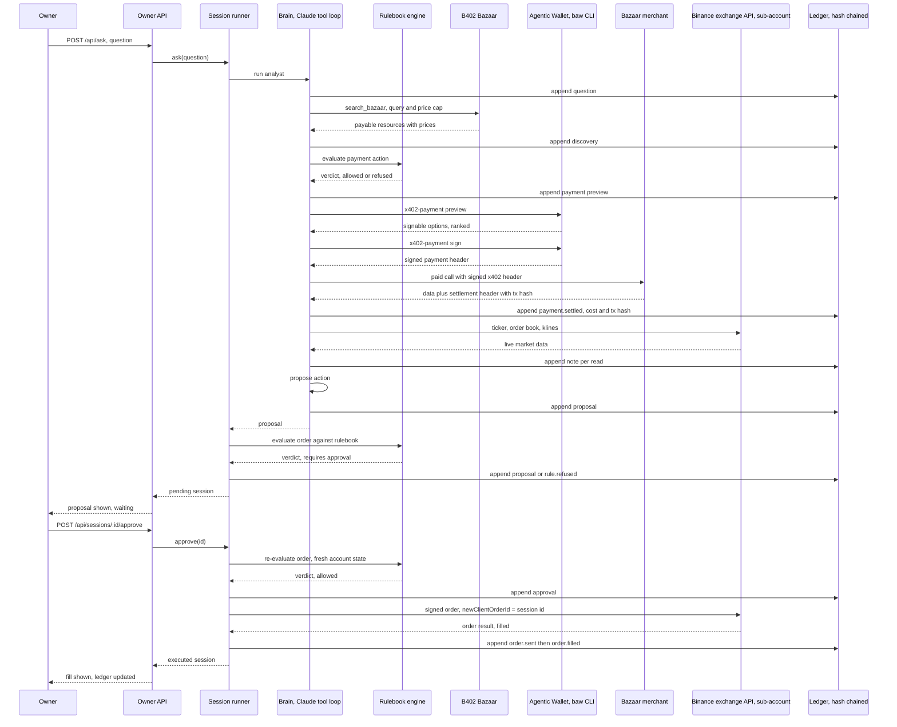

# How it works

One question, end to end, on a live order. This is the main sequence from `ARCHITECTURE.md`.

## The same story in words

**The question arrives.** `POST /api/ask` with the owner's bearer token. `SessionRunner.ask`
(`packages/agent/src/session/session.ts`) mints a session id of the form `ol-<uuid>`, writes a
`question` line to the ledger, and starts the analyst.

**The agent shops for data.** The brain (`packages/agent/src/brain/analyst.ts`) has one search
tool, `search_bazaar`. It searches Binance's public B402 Bazaar, which needs no key and no
account. Olai keeps only listings the Binance wallet can actually pay for and only the eight
cheapest, and it clamps whatever price cap the model asked for down to the rulebook's
`maxDataSpendUsdPerCall`. The model cannot raise its own budget.

**The agent buys one call.** The `buy_data` tool checks the rulebook first, in code, as a
`payment` action. If the rulebook refuses, the wallet is never asked to sign. If it allows, the
buyer (`packages/agent/src/x402/buyer.ts`) calls the merchant, reads the 402 response, asks
`baw x402-payment preview` for signable options, picks one, signs once, and replays the request
with the signed header. The merchant answers with the data and a settlement header carrying the
on-chain transaction hash. That hash goes in the ledger next to the cost.

**The agent reads the market for free.** Four read tools go through Binance's exchange REST API on
the sub-account: `read_ticker`, `read_order_book`, `read_klines` and `read_account`. These cost
nothing and touch no money. This same reasoning was meant to go through the Binance MCP server;
Binance's consent screen turned Olai's own client away, so these reads and the order below both
go over signed REST calls instead. See [Why Binance Agent OS](./why-binance-agent-os.md).

**The agent proposes.** The only output that leaves the brain is a `propose` call that parses
against `proposalSchema`: a summary, the reasoning, one action (`order` or `hold`), a confidence
between 0 and 1, the data it used with costs and transaction hashes, and the risks it sees. A
proposal is a request for approval, never an instruction to the exchange.

**The rulebook checks it.** `evaluate` in `packages/agent/src/policy/engine.ts` runs against a
fresh account snapshot. A refused proposal writes a `rule.refused` line and the owner never sees
a pending order. An allowed one writes a `proposal` line and waits.

**The owner decides.** `POST /api/sessions/:id/approve` or `/reject`. Approval is a real HTTP
call with the owner's token. It is never inferred from anything the model wrote. On the desk that
call is the **Approve** button on the proposal card, and **Reject** carries a one-line reason with
it.

**The order goes out, once.** On approval the rulebook runs a second time, against a snapshot
taken at that moment, because the day's loss, the open positions and the kill switch can all
have moved while the proposal sat waiting. Then `SessionRunner` marks the session as ordered
before calling the exchange, so a send that throws cannot be retried into two orders. The ledger
gets `approval`, then `order.sent`, then `order.filled` or `order.failed`.

## What each piece is

| Piece | Where | Job |
|---|---|---|
| Owner API | `src/api/app.ts` | The only door in. One user, one token. |
| Session runner | `src/session/session.ts` | The only thing that can place an order. |
| Brain | `src/brain/analyst.ts` | The Claude tool loop. Advises, never executes. |
| Rulebook engine | `src/policy/engine.ts` | A pure function. Runs before every payment and every order. |
| Ledger | `src/ledger/ledger.ts` | Append-only SQLite, hash chained. |
| Bazaar client | `src/bazaar/client.ts` | Public discovery of paid endpoints. |
| x402 buyer | `src/x402/buyer.ts` | One paid HTTP call, start to finish. |
| Wallet wrapper | `src/x402/baw.ts` | The `baw` CLI. Olai holds no keys. |
| Exchange REST client | `src/exchange/rest.ts` | HMAC-signed calls to the Spot REST API. The live trading door. |
| MCP client | `src/mcp/` | OAuth, the session, and the tool-name map. Coded and tested, held unused. |

All paths are relative to `packages/agent`.
