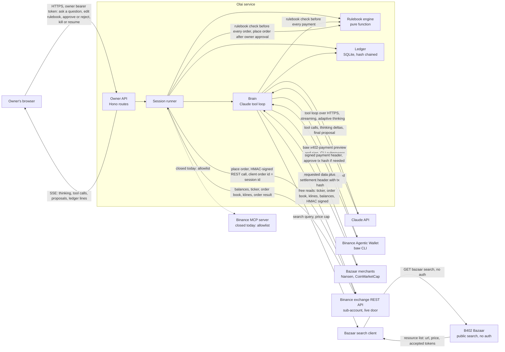
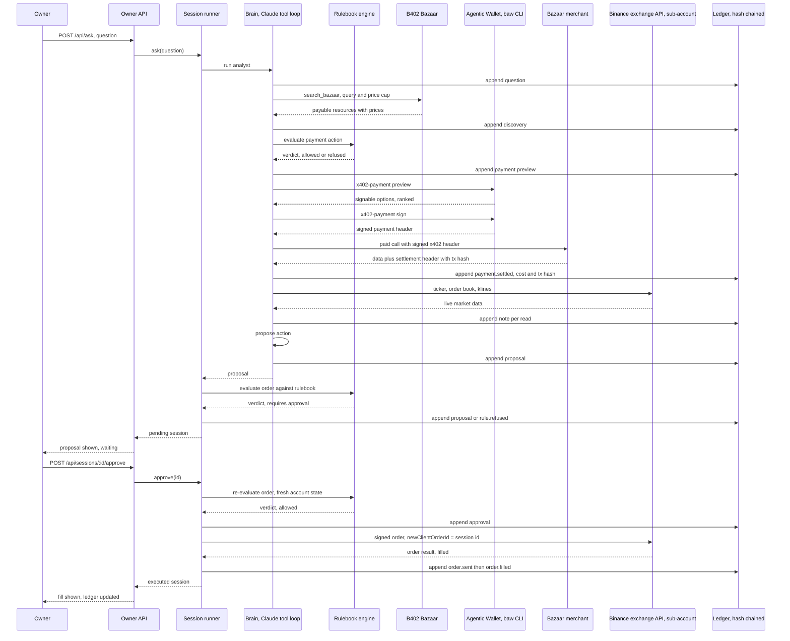
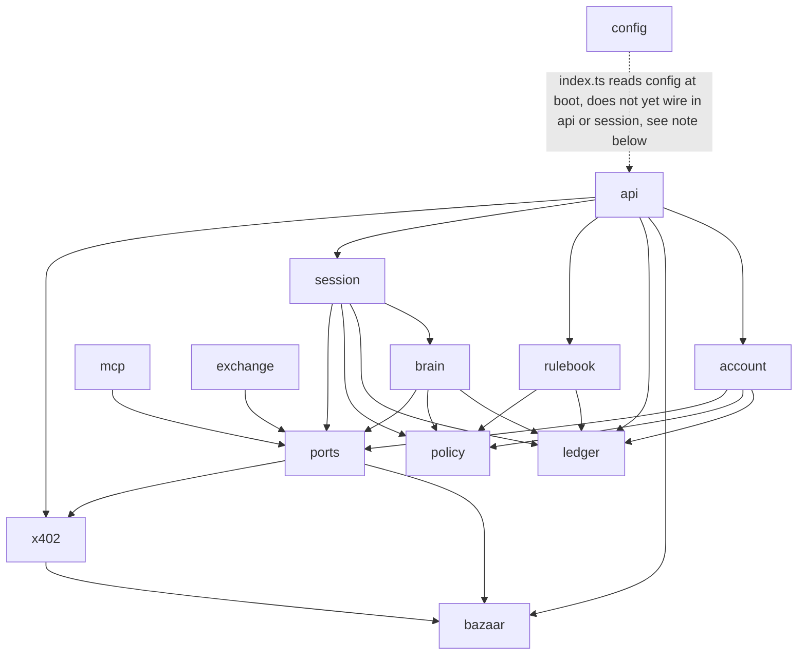

# Architecture

The three diagrams below are the ones in `ARCHITECTURE.md` at the repository root, unchanged.
The module graph is drawn from the real `import` lines in `packages/agent/src`.

## System overview



## Main sequence

One question, end to end, on a live order.



## Module dependency graph

Arrows drawn from the real `import` lines in `packages/agent/src`, read with grep rather than
by hand. Direction is "depends on".



Note on that last dashed arrow: as the code stands, `src/index.ts` only loads config and
serves a bare `/health` stub. It does not import `api/app.ts`, `session/session.ts`, or
`mcp/client.ts` yet, so the real owner API in `api/app.ts` is not wired into the running process.
`policy` and `ledger` are the two modules with no outgoing edges; they import nothing else in
`src`. `exchange` depends only on `ports` (for shared types) and is otherwise self-contained
across its own three files (`rest.ts`, `schemas.ts`, `sign.ts`); it is the door actually open,
because Binance's MCP consent screen refuses Olai's own OAuth client today. `mcp` depends only
on `ports` (for shared types) and is otherwise self-contained across its own four files
(`client.ts`, `exchange.ts`, `oauth.ts`, `toolmap.ts`); it is coded and tested but held unused
until Binance admits third-party agents.

That note records the state of `ARCHITECTURE.md` when the graph was drawn. `src/boot.ts` has
since been added, and it is what builds the service the way the diagram shows: it constructs the
ledger, the rulebook store, the account state source, the wallet wrapper, the exchange and the
session runner, mounts `oauthRoutes` and `createApp` on one Hono app, and `src/index.ts` serves
it. When the diagram and the code disagree, the code wins. Read `packages/agent/src/boot.ts`.

## Repository layout

```
packages/agent/src
  api/        the owner API, auth, errors, the event hub
  account/    equity, daily loss and data spend, read from the exchange and the ledger
  bazaar/     the B402 Bazaar client and its token tables
  brain/      the Claude tool loop and the proposal schema
  exchange/   the exchange REST client: HMAC signing, schemas, the live trading door
  ledger/     the hash chain, canonical JSON, the SQLite store
  mcp/        OAuth, the MCP session, the tool-name map, the exchange adapter (coded, held unused)
  policy/     the rulebook shape, the money helpers, the rulebook engine
  ports/      the interfaces the rest of the code depends on, plus fakes
  rulebook/   reading and writing the owner's rulebook file
  session/    the session runner, the only thing that can place an order
  x402/       the wallet wrapper, the buyer, the 402 decoders, merchant builders
packages/agent/scripts
  dry-run.ts, prove.ts, probe-bazaar.ts
docs/site     this documentation site
```
